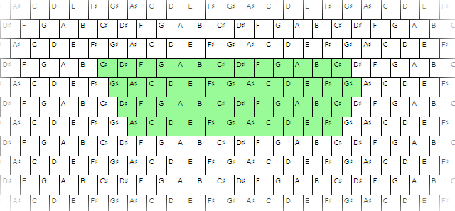
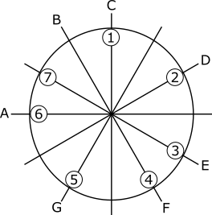
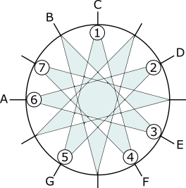
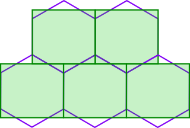
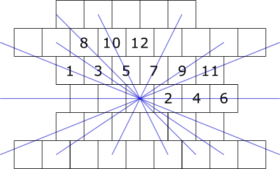
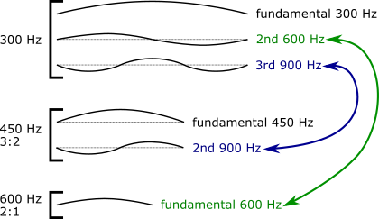
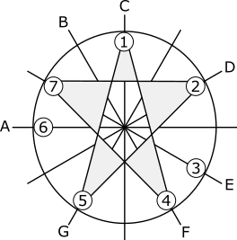
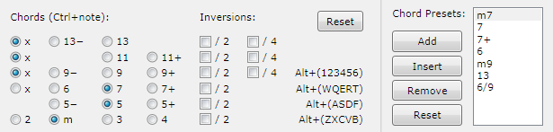

Musical Study with Isomorphic Computer Keyboard

[*Sergey A Kryukov*](https://www.SAKryukov.org)

A computer keyboard can be turned into an isomorphic musical instrument, to help in deeper exploration of the Musical Harmony and even to inspire new musical ideas 

<!--
 Налево от дивана стоял старый английский рояль; перед роялем сидела черномазенькая моя сестрица Любочка и розовенькими, только что вымытыми холодной водой пальчиками с заметным напряжением разыгрывала этюды Clementi. Ей было одиннадцать лет; она ходила в коротеньком холстинковом платьице, в беленьких, обшитых кружевом панталончиках и октавы могла брать только arpeggio. 

Л. Н. Толстой "Детство", Глава II. Maman
-->

<!-- Article starts here: --->

<blockquote id="epigraph" class="FQ">
Epigraphs:

On the left of the sofa, there was an old English grand piano. Before the piano, sitting was my dear black-haired sister Luibochka; by her pink, freshly washed with cold water fingers, she played, with noticeable tension, études by Clementi. She was eleven years old... could take octaves only <i>arpeggio</i>.

<dd>L. N. Tolstoy, <i>Childhood</i>, Chapter II. <i>Maman</i></dd>

&mdash; Do I have a right to..? 
&mdash; Oh yes, you have! 
&mdash; So, can I..? 
&mdash; No, you cannot.

<dd>Old human rights joke</dd>
</blockquote>

{id=image.keyboard}

## Contents

## Insights

Let's start with something simple. Let's say, we want to play with some sounds on a computer.

Apparently, first idea would be using available computer keyboard. What could we do with it? We could reproduce a pale imitation of the piano keyboard, which many applications do, but would it make any sense at all, with the keyboard's short rows, at best, 12-13 keys each. And what would be the use of the piano keyboard? No, if we want to experiment with sounds and study harmony, it makes sense only with some [chromatic](https://en.wikipedia.org/wiki/Diatonic_and_chromatic#Chromatic_scale) system.

After all, the computer keyboard is nothing like a linearly-structured piano keyboard. Rather, it's a matrix of four shorter rows, with first and last row not so usable for the purpose, se we better limit ourselves with four rows. Notably, in each row, the keys are shifted horizontally by approximately half-width of a key, relative to lower or upper row. That it, the geometry is pretty close to [translational symmetry](https://en.wikipedia.org/wiki/Translational_symmetry). Isn't that what we want? We can consider the set of keys as a [lattice](https://en.wikipedia.org/wiki/Lattice_%28group%29) of points of [rank](https://en.wikipedia.org/wiki/Rank_%28linear_algebra%29) 2 and associate a set of pitches with it. To make a decision, we need to consider only three neighboring keys in two neighboring rows --- it will define the pitches for all other keys. This 3-key subset can be considered as a [fundamental domain](https://en.wikipedia.org/wiki/Fundamental_domain) of the periodic lattice. Then we simply need two chose just two perfect intervals for this pattern: an interval between keys in a row and between rows.

Wait a minute... There are only two intervals called "perfect": [perfect fourth](https://en.wikipedia.org/wiki/Perfect_fourth) and [perfect fifth](https://en.wikipedia.org/wiki/Perfect_fifth). Shall we ever need anything less than perfect? :-) So, as the tones in a row should ascend left to right, let's assign left-top key to perfect fourth and right-top to perfect fifth. The interval between them is one full tone, so it should be the interval in any two neighboring keys in each row. Done.

{id=image.3}

This way, due to the symmetry, we had to consider the lower key as the one assigned to some [fundamental frequency](https://en.wikipedia.org/wiki/Fundamental_frequency), and the decision of other two came automatically. In terms of the Western [common-practice](https://en.wikipedia.org/wiki/Common_practice_period) [tone system](https://en.wikipedia.org/wiki/Musical_tuning), the three notes can be considered as 1st, 4th and 5th [degrees](https://en.wikipedia.org/wiki/Degree_%28music%29) of the traditional [major scale](https://en.wikipedia.org/wiki/Major_scale). These degree numbers are shown on the picture, and the "distances" are the rational frequency ratio values and distances in semitones (in brackets).

But why we consider only the perfect intervals and what's so perfect in those two? And the full-tone interval is special, too --- I would call it "second-fundamental". Why? Because these intervals play most fundamental role in entire musical harmony. Even though we started with "Western" [common-practice](https://en.wikipedia.org/wiki/Common_practice_period) [diatonic system](https://en.wikipedia.org/wiki/Diatonic_scale#.22Modes.22), the "perfection" goes well beyond this scope: it lies in the very fundamentals of physics, mathematics and musical perception. So, two special frequency relationships between tones are most fundamental in any thinkable musical culture and tone system --- they are perceived in a special way, because they are, following even more fundamental trivial (unison) and octave intervals, are the most special in terms of [harmonics](https://en.wikipedia.org/wiki/Harmonic).

I'll try to explain this fundamental nature in further detail [below](#heading.mathematical-view20of20tone20system).

## Motivation
There is nothing new in this idea, except, perhaps the idea of using the computer keyboard and particular keyboard geometry. [Isomorphic keyboards](https://en.wikipedia.org/wiki/Isomorphic_keyboard) do exist and their value is basically explained.

See also: [transpositional equivalence](https://en.wikipedia.org/wiki/Transposition_%28music%29#Transpositional_equivalence).

To me, the main source of inspiration was the hexagonal [Wicki-Hayden layout](https://en.wikipedia.org/wiki/Wicki-Hayden_note_layout).

See also: [Jammer keyboard](https://en.wikipedia.org/wiki/Jammer_keyboard), which already implemented in the form of commercially available hardware and [Thummer keyboard](https://en.wikipedia.org/wiki/Thummer_keyboard). Another variant is the [Jankó keyboard](https://en.wikipedia.org/wiki/Jank%C3%B3_keyboard).

I implemented both "Wicki-Hayden" and "Jankó" layouts in [a UI application](#heading.isomorphic-midi20keyboard20application), despite the big geometric difference: my variant uses normal rectangular keys. Nevertheless, the structural isomorphism is more important. And still, the question remains: is the computer keyboard shape and layout just the forced compromise, something much worse than the hexagonal Wicki-Hayden? I would not say so: just the opposite, I think that computer keyboards shape and layout has its benefits and can be used in design of a real musical instrument. First of all, I think it's easier to remember and navigate.

At the same time, the [suggested keyboard layout](#image.3) is highly suggestive of certain tonal relationships rooted deeply in the very nature of music.

I think understanding of these roots is a two-fold problem. First, the usual explanation of first principles is badly clouded with awkward explanations full of redundancies, enormously over-complicated terminology full of purely historical peculiarities, and the notation showing some real and often pretty simple structures in a very indirect way. From the other hand, some most important and non-trivial points are almost never formulated explicitly. Through the computerized study and some near-elementary analysis, I want to offer some food for thought, first of all, for myself, a non-professional musician rather coming from certain understanding of science. I also would like to stimulate some critical and rational thinking.  

## Mathematical View of Tone System

### Necessary Notes

Most of the considerations are based on Western [common-practice](https://en.wikipedia.org/wiki/Common_practice_period) view of musical harmony and, in particular, modern Western 12-tone [equally tempered](https://en.wikipedia.org/wiki/Equal_temperament) tone system. At the same time, the scope of most considerations is wider that that, so they can be applied to many other systems. The 12-tone system is used mostly to keep all the subject matter clearly illustrated with well-familiar sounds, as well as graphically. 

I assume the reader is at least familiar with the very basic musical notions, in particular, the idea of pitch, interval, sound frequency, scales and chords, and the basics of modern Western musical notation, first of all, Latin letter notation (C-D-E... notes with alteration sharp/flat/natural signs: ♯, ♭ and ♮). It's also good to have a fairly good idea on how these notes sound, but, if it is a problem, it can be easily learned, for example... using the [application](#heading.isomorphic-midi20keyboard20application) downloadable on the page of this article in the form of source code --- main purpose of this application is to serve as a study and illustration device.

Even if the reader does not have these prerequisites, this matter is not too hard to learn by appropriate reading. I also suggest some useful reading through the links found in the article. The skills of reading and understanding mathematical text of average complexity would very useful, but not absolutely necessary. 

### Rational and Irrational Numbers

When I depicted harmonic intervals with frequency ratio of [3/2, 4/3 and 9/8](#image.3), I was cunning. The real intervals depend on the tuning system and most usually differ from these precisely harmonic intervals. I hope many could see it or understand this aspect well. I just failed to find a better way to explain things step-by-step. This is actually a pretty painful problem of music in general, mostly because it's pretty hard to explain, especially to musicians, not mentioning the students of music who either remain unaware of the problem, or face major confusion due to the mess of facts and explanations which often conceal, not reveal the essence of things.

Let's start with something very basic. What should we understand by pitch? Frequencies of several musical tones are perceived in logarithmic scale. In other words, two intervals between pitches are perceived as equal if the frequencies of the ending pitches of the intervals are generated by multiplying the frequency of the starting pitches of the interval by the same factor. Subjectively, frequencies are *multiplicative*. In this sense, any number representing the pitch value has to be a logarithmic measure of the frequency. In this case, the pitch values are *additive*.

Now, let's look of at the [harmonics](https://en.wikipedia.org/wiki/Harmonic) of a pitch. First harmonics  corresponds to the [fundamental frequency](https://en.wikipedia.org/wiki/Fundamental_frequency) of some oscillator, and second harmonic, double frequency, is so strongly associated with the fundamental frequency in human perception (as well as in many other animals, which is experimentally known), that the pitches different in one or more [octaves](https://en.wikipedia.org/wiki/Octave) are considered "analogous" or "the same". This is called the principle of *octave equivalence*. Other harmonics have the frequencies multiplied by 3, 4, and so on. Which one can be taken for a pitch unit? No one. Such unit cannot be harmonic.

Due to the octave equivalence, any system of ascending/descending pitches can be consider as circular, because when it rolls over the octave boundary, it becomes the equivalent pitch of the analogous pitch of original octave. Such representation is called [chromatic circle](https://en.wikipedia.org/wiki/Chromatic_circle):

.

One detail on this picture may look confusing: the 7th degree is positioned on B-flat, not B, as it should be in the [major scale](https://en.wikipedia.org/wiki/Major_scale). I'll explain this choice (and the fact it's merely a choice) [later](#heading.mystery-of20mixolydian20mode).

First thing to note is that F and G are the only non-altered notes positioned symmetrically. The intervals between the tone and these notes are 5 and 7 semitones, but 7 can also be considered as 5 if counted counterclockwise, from higher to lower pitch, so the two are *reciprocals*. Let's see what harmonics are involved. The frequency ratio for F is 4:3, and for G it is 3:2. These set of numerator/denominator pairs is the simplest possible, not counting unison's 1:1 an octave's 2:1. Now, the frequency ratio for the whole tone between F and G is second simplest, as the combination of F and G ratio gives us 9:8.{id=special.reciprocal}

These intervals always sound pleasant and "consonant", especially the perfect fifth, totally irrespective to particular cultures of the listeners. This is because of the natural way our [auditory system](https://en.wikipedia.org/wiki/Auditory_system) works. It is also composed of the same set of [strings](https://en.wikipedia.org/wiki/Hair_cell) each resonating not only to its own fundamental frequency, but also to its harmonics. The response is stronger for the lower harmonics, so the system creates strong associations between the musical tones related as rational numbers of low-value numerator/denominator combinations. The same should apply to many other animals which quite obviously respond to music.

The thing is: in modern practice, all the intervals except unison and octave are not harmonic. Of course, it's always possible to tune any instrument to purely harmonic intervals; this is one of the approaches, pretty rarely used these days. Unfortunately, would make arbitrary transposition impossible: different tonalities cannot be equivalent. This problem is quite fundamental. It is pretty easy to prove that an attempt to achieve [transpositional equivalence](https://en.wikipedia.org/wiki/Transposition_%28music%29) always leads to [irrational numbers](https://en.wikipedia.org/wiki/Irrational_number). For example, the semitone interval in most used Western 12-tone [12-TET system](https://en.wikipedia.org/wiki/Equal_temperament) corresponds to the semitone frequency ratio equal to the root of the equation <b style="white-space: nowrap">semitone¹² = 2</b>. Irrational numbers can only approximate [rational numbers](https://en.wikipedia.org/wiki/Rational_number) corresponding to harmonic relations between pitches.

> Perhaps the only way to tackle this otherwise unavoidable contradiction is the use of the techniques of [dynamic tonality](https://en.wikipedia.org/wiki/Dynamic_tonality), but such approaches, suggested long time ago, are still in rudimentary stages. Notably, the isomorphism of the keyboard is considered as one of the prerequisites to the dynamic tonality.

Interestingly, the first proof of the existence of irrational numbers is usually attributed to [Hippasus](https://en.wikipedia.org/wiki/Hippasus), a philosopher of 5th century BC, who also put forward the basics of musical tone system.

But what are the errors in such approximation? How different are the pitches of the [equal temperament](https://en.wikipedia.org/wiki/Equal_temperament) from nearest harmonic relationships? We can get a good idea of it through comparison with [just intonation](https://en.wikipedia.org/wiki/Just_intonation). This is what my calculations show:
<pre lang="text">
1: C: error: 0 (unison, octave)
2: D: error: 3.91 (one full tone)
3: E: error: -13.7
4: F: error: -1.955 (perfect fourth)
5: G: error: 1.955 (perfect fifth)
6: A: error: -15.6
7: B: error: -11.7</pre>
The errors are shown in [cents](https://en.wikipedia.org/wiki/Cent_%28music%29).

It shows how special perfect intervals are: the errors are less than 2 cents. These intervals are indeed fundamental.

Let's note that the interval of one full tone, represented here by the second degree, can be considered as "second fundamental". Notably, corresponding error shown above is exactly the double of the error value for perfect fourth and fifth. This is explainable: the interval between perfect fifth and perfect fourth is one full tone, so the error of this interval is the combination of the error of the perfect intervals.

These considerations provide some explanation of the choice of intervals used as the base of the Wicki-Hayden layout and support my [reasoning](#heading.insights) in the choice of the association of the pitches to keys. Only three of the considered intervals are closed to harmonic ratio values; and all three are uses  as the base of the keyboard layout. As to the other intervals... people with good musical hearing can clearly detect the difference between harmonic intervals and equal-temperament intervals.

This contradiction between [equal temperament](https://en.wikipedia.org/wiki/Equal_temperament) and harmonic sound is one of the aspects which will lead us to a very exciting topic: [microtonal music](https://en.wikipedia.org/wiki/Microtonal_music). This topic is too broad to be considered in any serious way in this article. Just one note: in so called [historically informed performance](https://en.wikipedia.org/wiki/Historically_informed_performance) (another most exciting topic), forms of historical non-equal but harmonic-based tuning are used more and more often.  

### Orbits
The relationships between intervals in the tone system can be described in terms of [group theory](https://en.wikipedia.org/wiki/Group_%28mathematics%29). For our purposes, it will be very fruitful to consider an interval as a *[group action](https://en.wikipedia.org/wiki/Group_action)* which acts on a set of notes.

Suppose we have some group G *acting* on our set of tones. Let's say, we have some set of tones T with element t, t ∈ T. Let's apply the actions of some group G to a given element t. The set of resulting elements may or may not be the whole set T; generally speaking, it will be some subset of it. This subset Gt is called the *orbit* of the element t (with respect to the given group G):

Gt = { gt | g ∈ G } ⊂ T 

In our case, we need some groups which have only one element, so that each action is simply an operation of shifting some tone by given interval. When the resulting tone rolls over the octave, we shall consider it the same as the tone in original octave. In programming it corresponds to the operator `%`, [module operation](https://en.wikipedia.org/wiki/Modulo_operation). In other words, if we have some *function* accepting a tone as an argument and returning another tone, each combination of the function and actual argument value generates the set of resulting values.

See also: [orbits and stabilizers](https://en.wikipedia.org/wiki/Group_action#Orbits_and_stabilizers).

For example, if the set of actions is only one action, a shift by the interval of the whole tone, the tone C generates the orbit of 6 values, C, D, E. The note F will generate another orbit, F, G, A.... But the action of shifting by a semitone will generate the orbit which is the same as the whole set of all 12 notes.

From this moment, we will consider only the trivial subset of groups: transition between notes by adding a fixed interval. For us, it is interesting to find out intervals which define the [partition of the set](https://en.wikipedia.org/wiki/Partition_of_a_set).

It helps to understand the use of the word "orbit" for the term. Let's say, we start with C and add interval of one tone in sequence. We can infinitely continue the process and never land on F. Same thing happens if we start with F: will never land at C. These are two different orbits, that's it.

Naturally, special groups are those covering the whole 12-tone set. For example, if the group operation is shifting a tone y the semitone interval, we make a round and land in initial note, with the *period* of 7. If such period exists, I will call it *period of an orbit*.

Let's classify all the intervals into subsets characterized by the partitions each interval *generates*:

1. 0: 12: trivial orbits: generate 12 partitions of one pitch each
1. 1, 5 (perfect fourth), 7 (perfect fifth): generate 1 partition of all 12 pitches
1. 2: generates 2 partitions of 7 pitches each
1. 3: generates 3 partitions 4 pitches each
1. 4: generates 4 partitions 3 pitches each

We don't need to consider other intervals (8 semitones and more), by one simple reason: they are the *inversions* of those we already considered. In terms of [chromatic circle](https://en.wikipedia.org/wiki/Chromatic_circle), they are the same as lower intervals, only counted counterclockwise.

So, there is only one subset with more than one element --- the one with the elements { 1, 5, 7 }. It is also the only one where the actions generate the orbit of all 12 pitches. The group actions are shifts by one semitone or any of the two perfect intervals --- the perfects play the special role again.

The orbit generated by either perfect fourth or perfect fifth (two corresponding orbits are different only in phase and direction of motion) is shown as the blue 12-ray star on this picture based on [chromatic circle](https://en.wikipedia.org/wiki/Chromatic_circle):

It also illustrates well-known fact: entire 12-tone tone system can be generated as a combination of perfect intervals based on harmonic ratio values of 4:3 and 2:3. Unfortunately, this or any similar operation cannot generate [equal temperament](https://en.wikipedia.org/wiki/Equal_temperament), and equal temperament [cannot be perfectly harmonic](#heading.rational-and20irrational20numbers). (But fundamental principles of physics and mathematics cannot be "fortunate" or "unfortunate", can they? :-))

This simple classification additionally reveals the special and fundamental nature of the perfect intervals. Note that the one semitone is actually less fundamental. For example, using 24 tones in octave, as in [Arab tone system](https://en.wikipedia.org/wiki/Arab_tone_system), or modern 24-TET, would change the trivial orbits, enrich the musical language, but it would not change much it terms of musical harmony. This is a very general property: an inventor of any thinkable tone system, equal or not, no matter how many tones are used, will first take care of having perfect intervals and keeping then as perfect as possible.

In our keyboard, the horizontal rows represent two of the orbits generated by the interval of two semitones, interlaced: one row is C-D-E, another one is F-G-A, and so forth. Two perfect intervals represent diagonal moves: by 5 semitones if we move in up-left direction and by 7 semitones in up-right direction, perfect fourth and perfect fifth, respectfully.

The vertical lines define another kind of orbit: the vertical jump directly below or above lands to the same note in lower or higher octave. All other orbits can be obtaining be moving through this keyboard at different angles. We can move by semitone, diminished or augmented 3rd, and so on. The rule is very simple: it's moving along straight line by a fixed shift.

### Tone System as a Lattice, not a Sequence

Two factors: [octave equivalence](https://en.wikipedia.org/wiki/Octave) and [arithmetic progression](https://en.wikipedia.org/wiki/Arithmetic_progression) of the logarithmic scale of intervals define the [translational symmetry](https://en.wikipedia.org/wiki/Translational_symmetry) of the [equally tempered](https://en.wikipedia.org/wiki/Equal_temperament) sequence of musical tones. Such sequence (corresponding to an array of rank one in programming) can be considered as a [lattice](https://en.wikipedia.org/wiki/Lattice_%28group%29) based on the [group](https://en.wikipedia.org/wiki/Group_theory) of the tone shifts by some fixed interval. It is pretty obvious that this structure can be reproduced in a [vector space](https://en.wikipedia.org/wiki/Vector_space) of any [dimension](https://en.wikipedia.org/wiki/Dimension_%28vector_space%29) by choosing some [basis](https://en.wikipedia.org/wiki/Basis_%28linear_algebra%29) with corresponding tonal interval/shift for each basis vector. This way, translational symmetry in geometry will match translational symmetry in musical tones. For musical applications, the special case of three-dimensional space can be most interesting. In three-dimensional space, [5 lattice types are possible](https://en.wikipedia.org/wiki/Lattice_%28group%29#Lattices_in_two_dimensions:_detailed_discussion), or [17 crystallographic symmetry groups (wallpaper groups)](https://en.wikipedia.org/wiki/Wallpaper_group).

A two-dimensional lattice can be represented as a periodic *tessellation*. So, the keyboard geometry with associated pitches can be classified as one of the possible [tessellations](https://en.wikipedia.org/wiki/Tessellation). This concept itself is, in my opinion, one of the breathtaking topics in mathematics, first of all, due to existing of *aperiodic tiling*. But here we discuss much simpler periodic structures, with [translational symmetry](https://en.wikipedia.org/wiki/Translational_symmetry).

In certain sense, the [suggested structure](#image.3) defines the symmetry which matches the symmetry of tonal intervals. Let's consider the mapping between this geometry and the geometry of the [Wicki-Hayden layout](https://en.wikipedia.org/wiki/Wicki-Hayden_note_layout):

From this image along, it's apparent that the hexagonal tiling has the symmetry operation of consecutive rotations by π/3. In other words, there are three (or six, with sign taken into account) directions of translations passing through the sides of two neighboring hexagons. But the tonal shifts are different; they correspond to ±2 semitones in one case, ±5 or ±7 semitones in two other cases.

I would consider this as one of the disadvantages of the hexagonal keyboards. Its symmetry can be considered as *redundant*. If the keyboard orientation is unknown, it is not apparent from the geometry how the musical tones are assigned.

Such ambiguity does exist in our geometry, too, but it is resolved by only one test: the keyboard can be oriented upside down or not. The symmetry in respect to vertical axis is not really redundant: the diagonal directions with ±5 and ±7 semitones shift should really be symmetric: from the [chromatic circle](https://en.wikipedia.org/wiki/Chromatic_circle) it is apparent that +7 semitones is equivalent to &minus;5 semitones; and +5 semitones is equivalent to &minus;7 semitones. (I [already mentioned](#special.reciprocal) reciprocal relationships between perfect fourth and fifth.)

Also, our geometry seems to be simpler for learning and recognition. From this point, I'm going to regard our keyboard structure as *improved* [Wicki-Hayden layout](https://en.wikipedia.org/wiki/Wicki-Hayden_note_layout).

Now, let's take a closer look at the [translational symmetry](https://en.wikipedia.org/wiki/Translational_symmetry) in geometric-tonal space.

Any translation vector connecting any pair of keys generates a line with periodically pattern of tones positioned at some constant interval. Inversely, for any given interval, it's easy to find a vector with the corresponding to a nearest key assigned to the tone which forms this interval with respect to starting tone. For example, let's consider our variant of the Wicki-Hayden layout and find the translation vectors for all 12 intervals within single octave: 

0. { 0, 0 } or { &minus;6, 2 } unison
1. { &minus;2.5, 1 } semitone, minor second
2. { 1, 0 } full tone, major second
3. { &minus;1.5, 1 } minor third
4. { 2, 0 } major third
5. { &minus;0.5, 1 } perfect fourth
6. { 3, 0 } augmented fourth
7. { 0.5, 1 } perfect fifth
8. { &minus;2, 2 } minor sixth 
9. { 1.5, 1 } major sixth
0. { &minus;1, 2 } minor seventh
1. { 2.5, 1 } major seventh
2. { 0, 2 } perfect octave

Interval values are counted in semitones, and, for simplicity, the vectors are shown in [Euclidean space](https://en.wikipedia.org/wiki/Euclidean_space) with the units equal to the width/height of the key, if we assume the keys are square-shaped. And this is how the lines of periodic tone pattern corresponding to these intervals look on the keyboard:

{id=image.intervals}

Note that the tones at the octave interval lie vertically one over another and that the 8-semitone interval is the only one which has its symmetric translation vector beyond the current octave --- its nearest interval is 16 semitones.

One pretty [fuzzy](https://en.wikipedia.org/wiki/Fuzzy_set) observation: the directions based on more important and fundamental intervals tend to lie closer to diagonals while others tend to lie closer to the horizontal line, not counting the horizontal line itself, which represents very important major second.  

Anyway, it's pretty easy to perform glissando based on most of these intervals --- we just have to move at certain fixed angle, along the blue lines shown on the [interval chart](#image.intervals). Our keyboard introduces the whole family of novel glissando types!

To get a good feel of this structure, it would be good the practice using the software [application](#heading.isomorphic-midi20keyboard20application) which represents it in both graphical and audible form.

### Hair Cell Resonances

I'm afraid my reasoning referring to fundamental nature of [3/2, 4/3 and "second fundamental" 9/8](#image.3) could still look like some mantra. Why simplest rational numbers in frequency ratio values should be perceived by our [auditory system](https://en.wikipedia.org/wiki/Auditory_system) is some special way? With the ratio of 2/1 (octave), it looks clear: the same very resonator (say, hair cell sensor) resonates on its [fundamental frequency](https://en.wikipedia.org/wiki/Fundamental_frequency), but also on its double frequency --- second [harmonic](https://en.wikipedia.org/wiki/Harmonic). No wonder it can create string association between each frequency and its double value. But how about *fractional* rational numbers, such as 3/2 or 4/3? Will a resonator respond to the frequency of 3/2 of its fundamental? Not really. The relationship is a little more complicated and *indirect*. As it may be not 100% clear to everyone, I'll try to explain it. 

At birth, a human has about [3,500 inner hair cells and 12,000 outer hair cells](https://en.wikipedia.org/wiki/Hair_cell). As the inner hair cells work as the sound detectors, it means that, in principle, we can resolve up to 3,500 different tones or so. Strictly speaking, we can hear ("hear" and "resolve" are different things) some sounds beyond the set of fundamental frequencies of all those sensors. First, the sensors respond to harmonic. Second aspect is much more complicated: due to certain non-linearity of the auditory system, we can also hear combined frequencies; this phenomenon is quite complicated and unrelated to the scope of the present article. 

To explain strong natural associations between two most fundamental intervals, for example, octave and perfect "fifth", it's enough to consider exactly 3 hairs and 5 harmonics, no less no more:

The color lines show string associations we all have between different musical sounds at the frequency ratio of 2:1 (octave) and 3:2 (perfect "fifth"). Here and above, quotation in "fifth" are intentional: I wanted to show that it is a matter of convention. In different tone systems, if can be not 5th at all. Here, fundamental factor is frequency ratio; and the "degree" and "scale" simply don't exist at this level of perception.

On this picture, there are only three strings representing the inner hair cells. First and second strings are shown three and two times, to show different harmonics, so pay attention for the square brackets on left: they put together images of the same string. More importantly, strings are physically different, in my example, in length, which defines their [fundamental frequencies](https://en.wikipedia.org/wiki/Fundamental_frequency): 300, 450 and 600 Hz. On the picture, I expressed the differences in fundamental frequencies of string through different string lengths. Indeed, other factors being equal, the fundamental frequency is inversely proportional to the length of the strings, but resulting fundamental frequency depends on combination of factors, such as tension, thickness, more generally, geometry. By the way, if someone points out that my example with strings does not perfectly match the ear anatomy, I'll say that it does not matter. Any resonator will have fundamental frequency, 2nd, 3rd, 4th harmonic, and so on. This is all that matters.

This example of frequency values is used to show realistic well-perceived tones; it does not matter if the frequencies match any conventional notes; it's only important that their fundamental frequencies are 1, 3:2 and 2 of the frequency of the first string, which represents some *root note*.

So, let's see how it works on the frequency ratio 3:2. First string with fundamental frequency 300 Hz will strongly resonate on this frequency of the input acoustic signal, but also resonate, a bit weaker, on its second and third harmonics, 600 and 900 Hz. But in the same ear some other resonator can be found, with the fundamental frequency of 450 Hz (3:2 of 300 Hz) --- it is shown as the second string in the picture. It's important that it resonates on its second harmonic, 900 Hz --- same frequency as of third harmonic of first string. So, third harmonic of one string matches second harmonic of the other string --- 3:2 again. This is what creates string association between some frequency and 3:2 of it.

That's about the minimum of understanding of physics, physiology and mathematics needed to understand how music works.

## Culture Versus Physics

Music and its understanding is a whimsical combination of culture and objective laws of physics, which are totally independent from culture. For one thing, music as phenomenon of human life is impossible without culture. A musical piece is associated with certain mood majorly shared by very different people only because the body of other musical pieces people listened before. The fact of sharing similar feeling by little children does not disproof anything, because some basic core of this culture is absorbed extremely early and quickly.

But what part of musical perception comes from the pure nature and is independent from culture? Oh, it is still a big part. It's the audible range of frequencies, tolerable of pleasant timbers, and, very importantly, basic perception of harmony. Absolutely independently from any particular culture, octave intervals are perceived as a set of "almost the same" tones. What is called in Western practice "perfect" intervals will always be perceived as "pleasant" and "harmony". In any culture, even when "perfect fourth" is not "fourth" at all and "perfect fifth" is not fifth at all, these intervals will always remain "perfect", just because it is defined by the phenomenon of resonance and the way human brain associates the harmonics of the oscillators.

## Better Music Notation

One of the problems we are trying to overcome with the alternative chromatic keyboards is the insufficient chromaticism of traditional keyboards. In other words, they are too much suggestive of certain traditional [diatonic system](https://en.wikipedia.org/wiki/Diatonic_and_chromatic).

But traditional [modern staff notation system](https://en.wikipedia.org/wiki/Musical_notation) is no less distracting from the fundamentals of music, due to the preoccupation with the same diatonic system. Yes, formally, the traditional notation is fully abstracted from the instrument, which is very good, but it carries the apparent signs of the preferences of certain diatonic-oriented instruments, such as piano. Translational symmetry is assumed, but not directly expressed. So, even though the music for isomorphic keyboards, chromatic instruments based on translational symmetry, can be perfectly expressed in traditional score notation, but not fully adequate to it. A perfect notation really has to be chromatic and naturally display translational symmetry.

From the number of alternative chromatic notation systems I [looked through](http://musicnotation.org), I was most impressed with the [Clairnote notation system](http://clairnote.org) after Paul Morris Clairnote. Even though none of its principle looks unique, in my opinion, it provides nearly-optimal balance of visual clues, use of most familiar graphical elements, and graphical compactness. 

One of the impressive graphical elements is the use of familiar set of five score lines per octave, but with... missing central line, so the fragments of this line could be added only where the note is. It provides much better visual clue for navigation within the 5-line array. This element could be well used in traditional score graphics, but probably nobody got this wonderful idea.

Another notable feature of the notation is its "[6-6 Pitch Pattern](http://clairnote.org/6-6-pitch-pattern). It matches our keyboard layouts very nicely: the notes corresponding to the horizontal row are either all solid (for C-D-E rows) or all hollow (for F-G-A-B rows). It provides additional visual clue and helps to clearly see the intervals between notes.

In other words, just the graphics differs from the traditional score notation the same way brilliant UI design differs from the usual UI design. I feel that the authors of many of the ideas used in this notation deeply understand cognitive aspects of human perception, ergonomics, practice of musical performance, all that stuff.

In fact, this is a topic unrelated to the topic of the current article. I'm not using any certain musical notation and don't plan to implement any in my software any time soon. At the same time, I just want to bring it to the readers' attention to this notation, and to the alternative notations in general. I always was strongly dissatisfied with classical notation and basic pedagogical techniques. At the same time, after years of certain stagnation and decay of musical culture, what I observe now looks like a real musical revolution to me, especially in the fields of [historically informed performance](https://en.wikipedia.org/wiki/Historically_informed_performance), renewed interest to alternative note systems, revival of many historical instruments and, from the other hand, development of innovative instruments, and also the avalanche of brilliant young musicians. Maybe my hope is naive, but I want to hope that eventually it will also shift the situation to better in terms of theory, notation and education for the beginners. 

## Programming

### Isomorphic MIDI Keyboard Application

The application presents an on-screen keyboard in the [parallelogrammic-lattice](https://en.wikipedia.org/wiki/Lattice_%28group%29#Lattices_in_two_dimensions:_detailed_discussion) geometry with square-shaped keys close to the geometry and layout of the computer keyboard. The sets of pitches are assigned to the key set: one is analogous to the [Wicki-Hayden layout](https://en.wikipedia.org/wiki/Wicki-Hayden_note_layout), another one --- to the [Jankó keyboard](https://en.wikipedia.org/wiki/Jank%C3%B3_keyboard).

The middle part of the keyboard is assigned to the set of keys of the physical computer keyboard, as shown on the [top picture](#image.keyboard). The audio output is based in available MIDI synthesizer installed.

The application is a .NET WPF-based application. To maximize the set of compatible systems, it targets "Any CPU" architecture and .NET v. 3.5.

### Features

- The user can play on the keyboard using a pointing device (mouse, multi-touch screen, etc.), a physical computer keyboard, or both.
- At any moment of time, keyboard pitch assignments can be changed by transposition or selection of one of the pitch patterns, one based on Wicki-Hayden layout, another one --- on Jankó keyboard.
- By default, the keyboard covers the range of MIDI notes from 0 to 126. They note 127 can be reached by the transposition of +1 or more semitones. All the notes are visible and accessible at the same time.
- The volume of the sound is controlled by two parameters: volume for normal operation and "pedal" operation, which is played with "Shift" key. The volume values can be changed at any time and used at next activation of a keyboard key.
- All available MIDI instruments are grouped by standard instrument groups and are visible and accessible at the same time; the current instrument can be changed at any moment and used at the moment of next activation of a keyboard key.
- Chords can be automatically built and played when the root note is played with the key "Ctrl" pressed.
- A configuration of a current chord can be modified at any time. Any chord note (relative to root note) can be added/enabled/disabled separately. This way, all [common-practice](https://en.wikipedia.org/wiki/Common_practice_period) chords can be used. The inversions of the chords can be achieved by shifting the pitch of each note separately, down by one octave; by one or two octaves for degrees 9 to 13.
- In addition to direct definition of a chord, the current chord can be modified by selecting a chord in a list of *chord presets*.
- A list of chord presets can be modified at any time throw the Add/Insert/Remove/Reset operations.
- The keyboard keys can be marked in different ways. The notes on keys can be shown as MIDI notes (the numbers 0 to 127 in semitone steps) or in the popular Latin letter notation (C-D-E-F-G-A-B). Also, there is an option to mark the keys corresponding to the physical computer keyboard with associated characters.
- When a key is activated, it is highlighted.
- In addition to the highlighting of a currently active key, the automatically generated chords can be optionally highlighted in different color. Optionally, these chord names can be marked with the names of the chord notes in numeric notation: 2, 3 ("m" for unaltered major third), 4, 5, 6, 7, 9, 11, 13, possibly with &minus; or + sign.
- Groups of settings or separate settings parameters (current instrument, transposition, volumes, current chord, chord presets, layout and notation) can be reset separately or all together.
- Last settings set persists and restored at the start of application.

### MIDI API

For the purpose of the present application, just the [MIDI](https://en.wikipedia.org/wiki/MIDI) capabilities would suffice. Instead of using any third-party MIDI libraries, I prefer using [Windows Multimedia API (WinMM)](https://en.wikipedia.org/wiki/Windows_legacy_audio_components#Multimedia_Extensions_.28MME.29) directly, the way shown in the following fragment:

<pre lang="cs">
public class SimpleApi : IDisposable {

// ...
   
   // basic functions are exported from 
   const string dllName = "winmm.dll";
 
   [DllImport("winmm.dll")]
   private static extern int midiOutOpen(out int handle,
      int deviceID, MidiCallBack proc, int instance, int flags);

   [DllImport("winmm.dll")]
   private static extern int midiOutShortMsg(int handle,
      int message);

   [DllImport("winmm.dll")]
   private static extern int midiOutClose(int handle);

   public void Dispose() {
      midiOutClose(handle);
   } //IDisposable.Dispose

// ...

   // then messages are composed using bitwise operations, according to MIDI standard:

   public void NoteOn(byte note, byte velocity, byte channel) {
      int command = note &lt;&lt; 8 | velocity &lt;&lt; 2 * 8 | (int)ChannelCommand.NoteOn | channel;
      midiOutShortMsg(handle, command);
   } //NoteOn

   public void NoteOff(byte note, byte velocity, byte channel) {
      int command = (note &lt;&lt; 8) | (velocity &lt;&lt; 2 * 8) | (int)ChannelCommand.NoteOff | channel;
      midiOutShortMsg(handle, command);
   } //NoteOff

} //class SimpleApi
</pre>

In addition to that, all instruments are prescribed and grouped according to [General MIDI specification](https://en.wikipedia.org/wiki/General_MIDI). This is how the groups are defined:

<pre lang="cs">
public enum Instrument {
   AcousticGrandPiano,
   //...
   Applause,
   Gunshot
} //Instrument

public class InstrumentGroup {
   internal InstrumentGroup(string name, Instrument first, Instrument last) { this.Name = name; this.First = first; this.Last = last; }
   public string Name { get; private set; }
   public Instrument First { get; private set; }
   public Instrument Last { get; private set; }
} //class InstrumentGroup

public static class InstrumentGroupSet {
   static InstrumentGroupSet() {
      var list = new InstrumentGroupList();
      list.Add(new InstrumentGroup("Piano", Instrument.AcousticGrandPiano, Instrument.Clavinet));
      list.Add(new InstrumentGroup("Chromatic Percussion", Instrument.Celesta, Instrument.Dulcimer));
      //...
      Groups = list.ToArray();
   } //InstrumentGroupSet
   public static InstrumentGroup[] Groups { get; private set; }
} //class InstrumentGroupSet
</pre>

These definitions are used in the code automatically creating a panel of instruments with WPF radio buttons used to select current instrument. The controls are arranged and grouped in the given order and shown all at once. Such design is created in attempt to minimize any navigation and focus on the convenience of using the keyboard itself.

### Keyboard Dimensions

How many keys and rows of keys we need? It presented a pretty funny problem of *[combinatorics](https://en.wikipedia.org/wiki/Combinatorics)*. I've chosen precisely 11 rows, with the maximum length of the row of 35. For the purpose of stronger symmetry, the "long" rows of 35 keys are interlaced with "short" rows of 34 keys. This choice is not arbitrary at all. It is a result of relatively sophisticated calculations. This metrics appear if we consider the following hard and soft *constraints*:
- MIDI interface provides exactly 128 notes in semitone interval, 0 to 127. We want to have access to all or almost all of these notes at once, without transposition. This range also represents the frequency more or less audible to most of the people. (The actual audible range is noticeably wider, but generation of lower and higher pitches faces many technical limitations. Hearing of them starts to depend dramatically on the listener age and other physical factors.)
- The preferred keyboard shape would be symmetrical with respect to both vertical and horizontal axis.
- In this system, each row belongs to one of the two *orbits*, C-D-E or F-G-A-B. The keyboard shape should give a clear visual clue on that.
- Rows of each of the two orbits should be identical in size and horizontal alignment, to have exact one-octave interval between the notes of the same horizontal position.
- The keyboard needs horizontal orientation with some reasonable aspect ratio.

Having all that, the representation of 0 to 127 notes becomes the defining factor of the sizes. The combinatorial optimization gives the result closest to the optimum, with 0 to 126 notes shown.   

### Build

The application uses so-called *portable* deployment model; it does not require installation. It can be built from source by running the batch file "build.bat" without any parameters. It is based on the installation of .NET v.3.5 or later, which is usually pre-installe on most Windows systems and includes all the required build tools, and no any other software.

In rare cases when .NET is installed in some non-standard location, file "build.bat" needs to be edited to modify the path to MSBuild assigned to the variable `tool`. In even more rare cases when .NET is not installed, .NET v. 3.5 or later needs to be installed. 

## Using the Keyboard

### Fingering Charts

It turns out that both visual perception and motoric memory in humans is the most catchy in "2D". Giving rank 2 to the keyboards makes relationships between pitches much more graphical and well memorable. Depending on individual traits, some people better remember by fingers, some by pictures, but for fingering charts this is the same thing.  

The charts are always read in the same way: from lowest line up and then left to right within each line. If the keys are played in this order, it corresponds to the ascending order to scales or arpeggios. (Of course, with the given keyboard structure, it's always possible to give an example of the chart where the pitch is lower in the upper line, but for our purpose there is no use of such cases.)

Let's see how our keyboard layout can help to analyze and better understand different musical structures. The fingering charts themselves are not essential for the study, but they can help me to explain things. 

### Modes

Let's take our rectangular keyboard layout based on [Wicki-Hayden layout](https://en.wikipedia.org/wiki/Wicki-Hayden_note_layout) and try to examine if it has some benefits. Let's start, just for example with the modern [modes](https://en.wikipedia.org/wiki/Mode_(music)) based on the modern [diatonic scale](https://en.wikipedia.org/wiki/Diatonic_scale). Sometimes these modes are called "natural", but, to me, they are not more natural than many others. They just have the strongest affinity to the [common practice](https://en.wikipedia.org/wiki/Common_practice_period) diatonic system, in its present-day form. 

Here [they](https://en.wikipedia.org/wiki/Diatonic_scale#.22Modes.22) are:

1. Ionian:
 `C-D-E-F-G-A-B-(C) => 1 2 3 4 5 6 7 8`, [major scale](https://en.wikipedia.org/wiki/Major_scale)
2. Dorian:
  `D-E-F-G-A-B-C-(D) => 1 2 ♭3 4 5 6 ♭7 8`
3. Phrygian:
 `E-F-G-A-B-C-D-(E) => 1 ♭2 ♭3 4 5 ♭6 ♭7`
4. Lydian:
 `F-G-A-B-C-D-E-(F) => 1 2 3 ♯4 5 6 7`
5. Mixolydian:
 `G-A-B-C-D-E-F-(G) => 1 2 3 4 5 6 ♭7`
6. Aeolian:
 `A-B-C-D-E-F-G-(A) => 1 2 ♭3 4 5 ♭6 ♭7`
7. Locrian:
 `B-C-D-E-F-G-A-(B) => 1 ♭2 ♭3 4 ♭5 ♭6 ♭7`

In this list, the numbers represent the numbers of tonic with respect to [major scale](https://en.wikipedia.org/wiki/Major_scale). In other words, the sequence starts with 1st degree of that scale, C, for Ionian, with 2nd, D, for Dorian, and so on, as shown next to the [fingering charts](#heading.fingering-charts).

The modes consist of the same notes. So, why they sound differently? Medieval and Renaissance authors of Western Church, probably following Ancient Greek musicians and theorists, attributed deeply emotional [interpretations](https://en.wikipedia.org/wiki/Mode_(music)#Use) to their modes (somewhat different from the modern ones).

This is not because of the order --- the modes are used in melodies where the orders are different. They are just shown in different keys to demonstrate, in a traditional way, the principle of their generation. Traditionally, the modes are compared at the same key, or, equivalently, [noting their difference from the Ionian](https://en.wikibooks.org/wiki/Music_Theory/Modes). We can take some mode at a fixed key, usually C, and create other modes by [alteration](https://en.wikipedia.org/wiki/Altered_chord) of some degrees. But not all alterations are considered "natural", only those generated by cyclic reordering apparent from the list shown above. To see the alterations, it's enough to build the mode at the keys C-D-E... and later [transpose](https://en.wikipedia.org/wiki/Transposition_%28music%29) them to the same key. The cyclic re-ordering simply pushes other notes by one or two semitones, so rightmost tones rolls over to next octave. This operation is referred to as [inversion](https://en.wikipedia.org/wiki/Inversion_%28music%29) of intervals. When we transpose the result of inversion to the same key, we obtain altered modes. Due to the [translational symmetry] of the layout of our keyboards, the transposition is reduced to shifting any of the fingering charts to an arbitrary position, keeping the same geometric relationships between key positions. That's why I never show root note in my fingering charts (it is always the leftmost key of the lowest row): in computing terms, the fingering chart is [invariant](https://en.wikipedia.org/wiki/Invariant_%28computer_science%29).

### &ldquo;Musically Deformed Pentagram&rdquo;

Let's look at the star shape I added to the [chromatic circle](https://en.wikipedia.org/wiki/Chromatic_circle):

I connected five notes this way to express the following ideas 1) in C key, it is a geometric figure symmetric with respect to the axis of C; 2) the intervals used are only perfect most fundamental intervals of F and G, and the "second-fundamental" interval of one full tone, counted clockwise for D and counterclockwise for ♭B. If everything is so harmonic and symmetric, we can expect this structure to play some special role in music.

Indeed, this structure is called [major pentatonic](https://en.wikipedia.org/wiki/Pentatonic_scale#Major_pentatonic_scale), if counted clockwise from ♭B to G. As the modes and scale are traditionally described as sequences starting from C, let's perform the transposition by tilting the head by &minus;π/3 (or imagining doing so), to make the axis of D as the axis of symmetry. Then we will get to the sequence C-D-E-D-A. This is how it can be fingered on our keyboard, exactly in the same star symmetry:
.

No wonder, this structure also plays fundamental role in music, perhaps, in some respect, even more fundamental than traditional Western minors and majors. It would be a common mistake to consider it as a "usual" [heptatonic scale](https://en.wikipedia.org/wiki/Heptatonic_scale) with some degrees skipped. Rather, it is the primary and independent structure. To Western ear, it may sound as "Chinese" (and indeed is used in the music of China) but is actually natural to folk music of many countries, as well as spirituals, gospel, jazz... well, it's easier to read [the article](https://en.wikipedia.org/wiki/Pentatonic_scale) than to list.

Now we can do the [same exercise as with heptatonic modes](#heading.modes). Obviously, five different pentatonic modes can be considered. Each of such modes can be obtained by starting with one of the C-D-E-D-A keys and shifting other keys cyclically. Then, for comparison, all resulting sequences can be transposed to the same key. 

Now we can try to uncover one mystery. One of the "natural modes" listed [above](#heading.keyboard-usage) is also special. Oddly enough, this is not the traditional "C-D-E-F-G-A-B" Ionian. This is Mixolydian. By some reason, it is related to the modern digital chord notation. Let's try to explain it.

### Mystery of Mixolydian Mode 

There is some apparent inconsistency in chord terminology compared with scales or modes terminology. When, for example, the [common-practice](https://en.wikipedia.org/wiki/Common_practice_period) major scale is discussed, B is called 7th degree. When a chord is built and 7th *chord note* is used, ♭B is regarded as unaltered seventh, which is denoted without any alteration signs such as ♭ or &minus;; this is just one of the peculiarities of notation. However, I can just speculate that this is also related to somewhat different function of certain chord notes and melodic nodes of the mode. In modern practice, such seventh chord is usually called [dominant seventh chord](https://en.wikipedia.org/wiki/Dominant_seventh_chord) (note ♭B on the top picture) and regarded as "the most important of all the seventh chords". Diminished B is used to put additional dynamism to the chord and give it more dissonant and "introductory" character, as it usually opens a different circle of musical motion. This very basic and even boring device of musical *phrasing*, especially typical for modern folk or popular music, was notoriously rare in earlier usage, even during earlier [common practice period](https://en.wikipedia.org/wiki/Common_practice_period), before some period of time closer to 19 century. At that time, diminished seventh was considered as [embellishing or nonchord tone](https://en.wikipedia.org/wiki/Nonchord_tone), so modern "dominant seventh chord" of the C-E-G-♭B would not even considered as a valid chord.

At the same time, diminished seventh sounds quite harmonic, which is related to the reasons I tried to explain in relation to [pentatonic](#heading.26ldquo3bmusically-deformed20pentagram26rdquo3b) system. Indeed, the correlation between harmonic value and subjective "consonant" or "dissonant" qualities is not so straightforward; such perception also [highly depends on cultural factors](#heading.culture-versus20physics).

Interestingly, there is a number of historical/cultural peculiarities around the notes B and ♭B. In some European countries, these notes have different names and denoting letters. In "our" notation B means the note si (ti) at the interval 11 relative to C, and ♭B, si/ti-bémol/bemolle/flat at the interval 10. At this moment, to avoid any assumptions on which notation is "correct", let me use the non-ambiguous names si and ♭si. In some cultures, si is denoted as H, and ♭si as B. The H notation is often [referred to as](https://www.library.yale.edu/cataloging/music/keylang.htm) "German", but its use is [much wider](https://en.wikipedia.org/wiki/Key_signature_names_and_translations). I personally also used to H as si more than to B. Even in the same country, both B and H-notation can be found in publications, most typically in popular music. If H is found, it becomes clear, but if not, how to understand "B"? Imagine confusion of the readers, mostly amateur musicians, who would have to derive the meaning of it from the context.{id=special.German.H}

Anyway, we can imagine what could be the root cause for this mess. The reason is that in C key ♭si forms fundamentally harmonic interval if it is considered as C shifted down by one full tone (counted counterclockwise on the [chromatic_circle](https://en.wikipedia.org/wiki/Chromatic_circle)), but si is not. But unaltered si plays its role as 7th in the C [major scale](https://en.wikipedia.org/wiki/Major_scale) as its [leading tone](https://en.wikipedia.org/wiki/Leading-tone).

So, coming back to ♭si (♭B) as 7th degree... Let's summarize. In C [major scale](https://en.wikipedia.org/wiki/Major_scale), 7th degree is si (B). The other natural-mode scale where all notes are the same except for B altered down to ♭B is the only one, [Mixolydian](https://en.wikipedia.org/wiki/Mode_%28music%29#Mixolydian_.28V.29). And finally, another place where the note ♭si (not si) is considered as 7th degree in C key is the modern alphanumeric notation for chords. Even though when the chord is considered as major seventh in C key, in contrast to C major scale, the 7th is ♭si (not si). 

Pretty simple observations reveal how the modern classification of chords is built. It can be represented as a sequence of following steps:{id=special.chord.steps}

- Take the sequence of notes corresponding to mixolydian mode. For simplicity, let's consider C key, then it will be C-D-E-F-G-A-♭B.
- Take every third node, starting from the triad: 1-3-5. In C, it gives us C-E-G, major triad.
- Optionally add 7th, which gives us C-E-G-♭B.
- For any of these notes, alter any of the degrees except 1st by a semitone. Note that diminished 7th will become 6th, but, in this context, we should better consider 6th as the note "in the zone of sevenths". Also note that diminished 3rd corresponds to the notion of "minor".
- Basically, it fully covers all the chords within octave, not counting [inversions](https://en.wikipedia.org/wiki/Inversion_(music)) and pretty special case of "suspended" chords I will have to explain [separately](#special.suspended).
- From this point, we can optionally add 9th, 11th or 13th, which are essentially 2nd, 4th and 6th rolled over the octave. In C, if these notes are unaltered, they become D, F and A.
- Optionally, alter any of the 9th, 11th or 13th (if any of them present), by one semitone, up or down. Again, while 9th can be diminished or augmented, 11th can only be augmented and 13th can only be diminished, otherwise alteration should land in a zone corresponding to a different degree of our mode.

Having all that, let's get into the chord structure.

## Chords

My explanation of the chord structure will be based on the part of the UI of the [application](#heading.isomorphic-midi20keyboard20application) marked as "Chords". The choice of required chord structure is performed by checking certain radio buttons or check buttons.

### Structure of Chords

This is how the chord structure is represented in the UI:

{id=image.chords-ui}

If it's not quite clear, let's clarify what it means:

<table class="frame">
<tr><th>Use/2</th><th>&minus;</th><th>Pure</th><th>+</th><th>Default</th></tr>
<tr><td>x</td><td>13&minus;</td><td>13</td><td></td><td>x</td></tr>
<tr><td>x</td><td></td><td>11</td><td>11+</td><td>x</td></tr>
<tr><td>x</td><td>9&minus;</td><td>9</td><td>9+</td><td>x</td></tr>
<tr><td>x</td><td>6</td><td>7</td><td>7+</td><td>x</td></tr>
<tr><td></td><td>5&minus;</td><td>5</td><td>5+</td><td>5</td></tr>
<tr><td>2</td><td>m</td><td>3</td><td>4</td><td>3</td></tr>
</table>

The table should be read and used from bottom to top. This is because I tried to conduct the idea of the tone "height" in both keyboard layout and notation: the higher pitch is shown higher. The chord structure is based on the steps explained [above](#special.chord.steps).

I think everything should be clear here, perhaps except the first column and last row:
- The numbers 1 to 13 denote the degree of the *mixolydian mode* which can be associated with the root of the chord.
- The number 1 is omitted, because this is a root of the chord
- &plus; or &minus; denote ♯ or ♭, *sharp* or *flat* sign, one-semitone alteration, up and down, respectively.
- "m" simply means 3&minus;; it represents the idea of "minor" harmony of the [common-practice](https://en.wikipedia.org/wiki/Common_practice_period) terminology.
- "x" represents the absence of any notes in the table row.
- Set of default values "1/3/5" constitutes [*major* triad](https://en.wikipedia.org/wiki/Major_chord).

The degree 1 is not shown, because this is a base note, always played. It's possible not to play it, but then it means some other chord, with some other base note.

In last row, second and third degrees of [triads](https://en.wikipedia.org/wiki/Triad_%28music%29) are placed, but I also merged, voluntarily and just for saving application's screen space, four traditional triads with sus2 and sus4, where the usual third is missing and replaced with second or fourth, respectively. By doing so, I also avoided the option of missing third, because third can really be missing, but either 2nd, 3rd or 4rt always presents in the chord. Therefore, in the leftmost column, "2" takes the place of "x", which give a weird name to the columns header.

The similar consideration helps to understand some degrees lack why + or &minus; alterations: due to diatonic nature of base tone system (Mixolydian mode), a semitone alteration may land to another degree, so it would simply take a different name and take a different place in the structure.

First two lines produce all [triads](https://en.wikipedia.org/wiki/Triad_(music)). Starting with 1, default intervals in semitones, are 4-3 (major), 3-4 (minor), 3-3 (diminished) and 4-4 (augmented). In traditional numeric chord notation, triad notes in "pure" positions (3 and 5) are never shown. So, if the root note is C, the names are C, Cm, C5&minus; (sometimes C°) and C5+ (sometimes C+).

But I also added, for convenience and saving some screen place, two "[suspended](https://en.wikipedia.org/wiki/Suspended_chord)" chords to the line of 3rd, because, combined with 5; they will give sus2 or sus4, mutually exclusive with classical triads. The intervals are 2-5 (sus2) and 5-2 (sus4), in case of pure 5. Let's look at them first.

I think the "suspended" chords are vastly under-estimated, if not misunderstood. Let's see how our keyboard layout reveals their fundamental nature: this is sus4:  and this is sus2: . The fingering occupies our "fundamental key triangle" by obvious reasons: the use of notes correspondent to perfect intervals for sus4, which is also called a [quartal chord](https://en.wikipedia.org/wiki/Quartal_and_quintal_harmony). As to sus2, its transposition by +5 semitones (perfect interval again) results in the same symmetric structure if 5th degree plays the role of 1st, so they reciprocally conjugate each other; and this symmetry is strongly suggested by their fingering charts on our keyboard. Interestingly, such chords without 3rd were not considered as chords during entire [common-practice period](https://en.wikipedia.org/wiki/Common_practice_period): until certain period of time, our 2nd or 4th would be considered as [nonchord tone](https://en.wikipedia.org/wiki/Nonchord_tone).{id=special.suspended}

Now, let's took on classical triads based with major or diminished 3rd: major , minor , diminished , augmented .

It may seem a bit strange that so fundamental chords as minor and major are so asymmetric. But they are not supposed to be symmetric without their *complementary* counterparts of [parallel keys](https://en.wikipedia.org/wiki/Parallel_key). Below, first three lower notes (yellow) constitute major triad, followed by minor triad of its parallel key (blue):

. For example, it could be C + Am. Now it's as symmetric as it can be. :-)

Let's move further up. Actually, the presented scheme covers most of the chords commonly (and not so commonly) found in numeric chord notations. Next upper line is 6th/7th. They are also merged together for pretty obvious reason: 7th can be augmented and then called 7+, but making it flatter brings it to 6th. This is how they are fingered: 6 , 7  and 7+ .

The 9th, 11th and 13th degrees are, essentially, 2nd, 4th and 6th played one octave higher.

Some notation elements are confusing so, I need to explain it. One is simple: "maj" or "M" means 7+. Another one, "dim" is sometime confusing. Actually, it is m5&minus;/6, fingered as . This confusion in naming is explained in the article where the chord is classified as "[diminished seventh](https://en.wikipedia.org/wiki/Diminished_seventh_chord)" --- not quite clear why not "diminished sixth". It's very unfortunate that this very special and important chord has become a subject of this bloody mess in naming and notation. As it consists of four tones at the uniform intervals of 3 semitones, precisely a quarter of the full [chromatic circle](https://en.wikipedia.org/wiki/Chromatic_circle), there are only four such chords with distinct root notes --- others are inversions of each other. Typical musical semantic (or function) of this chord is also pretty interesting: roughly speaking, it can sound harsh or very melodic, "minor" or "major", depending on the context of a musical *phrase*. Please read more detailed sentiments on this topic in this [section](https://en.wikipedia.org/wiki/Diminished_seventh_chord#Expressive_potential).

Another confusing point is skipping rules. Higher degrees starting from 7 are skipped from notation if 1) they are used in "pure" position, higher degree is present. For example, C9 means the same as C7/9 --- 7th is actually played but skipped from notation. From the other hand, altered 7 needs to be prescribed: C7+/9, C7-/9. But if some degree starting with 7 is not actually played, higher degree comes with prefix "add". For example, Cadd9+ or Cadd9 means that 9th is played over the major triad, but 7th does not sound.

How to use it? First of all, the application automatically generates chords, if a note is prefixed with `Ctrl+`. In addition to what's described above, inversion of all chords can be build using frequency dividers (`/ 2' in UI) for each note of the chord.

So, what can we do with it? First of all, the application helps to build up a chord using the structure described above, with the UI portion quite similar to the table shown above. Then the chord can be build automatically when the user plays a root note with `Ctrl+note`. When a chord is played with the on-screen keyboard, the chord notes can be automatically located on the screen and highlighted. Moreover, optionally the on-screen keys show the numeric notation for each chord note ("2", "m" (minor), "3" (major), "5+", "7", "7+", and so on). It does not matter how the note is played, through the physical computer keyboard or using the mouse, trackball or touch screen.

This can be used to study the chord structure and to find presumably convenient fingering for each chord. As each note can be played, generally, in more than one position, the on-screen *chord location finder* optimizes the choice of alternative location, using the simple principle: the keys geometrically closer to the location of the chord root key are preferred. Optionally, the chord notes (except 1st) are highlighted in yellow.

A chord can also be taken manually through the keyboard. The study of the auto-generated chords can help to understand the chord structure and get used to playing them. However, there is one but...

### Keyboard Fights Back: Rollover Problem

The problem can be described as the [lack of n-key rollover](https://en.wikipedia.org/wiki/Rollover_(key)). It means the inability of a keyboard to correctly handle several simultaneous keystrokes. At the moment of writing, I'm doing it on my laptop and play with my application. If I keep a row of four keys down, none of any neighboring sends keystrokes to the computer. This is a matter of the hardware, keyboard circuitry (lack if *isolation diodes*) and controller, the effect of the reduction of the keyboard cost and design complexity.

Without finding out and buying a better keyboard, there is [nothing we can do](#special.no-you-cannot) about it. We can play [like Luibochka, only arpeggio](#special.luibochka-arpeggio). Another way of tacking chords would be using the feature of chord generation and especially [chord presets](#heading.chord-presets).

Another problem is related to the notion of [translational symmetry](https://en.wikipedia.org/wiki/Translational_symmetry). Strictly speaking, when it comes to the standard computer keyboards, they are not so symmetric --- its layout is considerably distorted. Its "Q" row is shifted relative to the "A" not as symmetrically as "A" relative to "Z". For real playing, it would be a serious critical hassle, but, after all, we only study...

### Chord Structure is not Unique

Due to the possibility of inversions, there is no a one-to-one correspondence between set of notes played as a chord and chord structures. Rather, the mapping from the sets of notes to the chord structures is a [surjective function](https://en.wikipedia.org/wiki/Surjective_function).

For example, the set of notes C-♭E-G-♭B can be classified as Cm7, but it also can be considered as major triad of ♯D with 6th, ♯D6. 

That's why any non-nonsense software function offering "chord naming" often provides more than one variant of the answer. Strictly speaking, it is not always possible to choose "correct" representation of notes as a chord structure. However, it's usually possible to choose based on the [function](https://en.wikipedia.org/wiki/Diatonic_function) of the chord in certain musical [phrase](https://en.wikipedia.org/wiki/Phrase_%28music_theory%29). *Generally*, a separate chord does not have definitive sense outside of the context.

### Chord Names

The names of the chords used in different source are very confused, not officially standardized anywhere and, in my opinion, should not be taken too seriously. Only score-based notations can be taken as pretty firm standard-de-facto, so they should be learned anyway. Sometimes, the readers need to do a guesswork and figure out what the notation really means from the context, which is, strictly speaking, is only possible when a piece of music is known to the reader. I already mentioned that "dim" sometimes can be understood as diminished triad or m5&minus;/6. Also, "maj" typically means 7+, but sometimes "major". Another source of ambiguity is the symbol '°'. It may mean diminished triad, but sometimes it is used for "dim". Also, [sometimes](https://www.apassion4jazz.net/jazz_chords.html) the special symbol Ø is used for so-called "half-dim", which is similar to "dim" but its 7th is not diminished. And assuming [H notation](#special.German.H) for si in the situations when the letter "B" appears and "H" can make it a nightmare. Hopefully, all this mess happens mostly in simplified publication of popular music pieces well known to the reader.

Besides, chord names in notation are usually "optimized" to make them shorter. For this purpose, notes can be reordered to minimized the number of delimiters (usually '/'). Say, in "C7+5", 7th comes before 5th only to avoid extra delimiter "+5/7". Well, maybe even "57" would be clearer: some write + or &minus; after digits, some before and strongly insist on it, to match prefixed form of ♯, ♭ and ♮ in [standard scores](https://en.wikipedia.org/wiki/Musical_notation#Modern_staff_notation). It creates yet another kind of ambiguity.

I mention all that primarily to note that in the [application](#heading.isomorphic-midi20keyboard20application) UI, chord names appear only in one place: chord presets.

### Chord Presets

The purpose of the chord names in presets is somewhat different from the usual use of the chord notation. So, my naming is a bit different from what people [usually write](#heading.chord-names) in chord notation; for example, '/' delimiters are used to avoid ambiguity in reading, even though actually selected chord can also be read on the left of the presets. 

I hope the part of the UI for chord presets is [self-explaining](#image.chords-ui).

I only want to explain the order of chords in the default presets. The purpose of presets is quick selection of chords to be automatically played with "Ctrl" key. For example, in a typical minor chord progression, the user can keep preset selection at "minor" signature, quickly shifting to "7" or "major", which are the most used in such progressions. The user can quickly modify the presets to the current needs, and this choice persists between the sessions in the application runtime. 

## Future Work

Some further ideas include
- User-defined keyboard layouts. It can be useful for the users using the keyboard with physical layout different from en-US kinds of keyboard.  
- Keyboard split. It would be possible to define one or more areas on the keyboard to be set up separately: for each area, the choice of instrument, volumes and transposition could be different.
- MIDI recording. I'm not sure if it would be a valuable option or not. After all, the application cannot work as a serious musical instrument to really perform on it. Rather, it can be used as learning and experimenting tool.
- Covering other alternative tone systems, such as [19-TET](https://en.wikipedia.org/wiki/19_equal_temperament) or [31-TET](https://en.wikipedia.org/wiki/31_equal_temperament) would be extremely interesting and fruitful (presently implemented; see [below](#heading.future-is-already-here)).
- Another [microtonal](https://en.wikipedia.org/wiki/Microtonal_music) approach would be using [dynamic tonality](https://en.wikipedia.org/wiki/Dynamic_tonality) changing explicitly (with some additional controls) or on some triggers (appearance of certain chord or sequence during musical motion) based on preset created before performing.
- Instead of .NET, using Web browser-implemented [Web Audio API](https://www.w3.org/TR/webaudio), for ultimate cross-platform compatibility (presently implemented; see [below](#heading.future-is-already-here)).

### Future is Already Here

At the moment of writing, some of the plans mentioned above have been implemented. Next work on this topic is published in beta version. It is a pure in-browser HTML/JavaScript application, so anyone can [try it out](https://sakryukov.github.io/microtonal-chromatic-lattice-keyboard/index.html) without downloading. It addition to the present work, it is also ***microtonal*** and offers some interesting extras, such as tone/chord comparison for different tone systems. Surprisingly, due to the keyboard layout discussed above, basic playing skills acquired and techniques learned for one tone system are immediately applicable to other tone systems.

The biggest part under development is the chord generation and visualization, similar. It will take more time. Certainly, it will be a topic of my next article. Most other features are fully functional at this moment.

Presently, the following [tone systems](https://en.wikipedia.org/wiki/Musical_tuning) are supported:
- [Just Intonation](https://en.wikipedia.org/wiki/Just_intonation) (only [presented](https://sakryukov.github.io/microtonal-chromatic-lattice-keyboard/tone-system-comparison/tone-system-comparison.html) on the [chromatic-circle](https://en.wikipedia.org/wiki/Chromatic_circle) keyboard)
- [Common-practice](https://en.wikipedia.org/wiki/Common_practice_period) [12-TET](https://en.wikipedia.org/wiki/Equal_temperament)
- [19-TET](https://en.wikipedia.org/wiki/19_equal_temperament)
- [31-TET](https://en.wikipedia.org/wiki/31_equal_temperament).

The entire project is [found on GitHub](https://github.com/SAKryukov/microtonal-chromatic-lattice-keyboard).

## Conclusions

Of course, ultimately, it does not matter how the controls of the instrument pitches are arranged. Given another accessibility and convenience, anything can be learned and used for performance. But those arrangements and layouts can be more or less suggestive of some relationships between tones. We have a long history of observing how different emerging musical instruments affect music itself. So why we cannot devise something which expresses most deeply-rooted relationships more clearly, in contrast to traditional keyboard?

Development of musical instruments, as any other objects produced by civilization, is driven by two forces: habits and conceptions. Good or bad, but habits massively win in absolute majority of changes, while conceptions pave their way throw extremely difficult barriers, most of them also related to habits --- call them "education", but I prefer using the term "training", as opposed to education, which is always conceptual in its nature.

I may seem that the era of electronics would remove many barriers and open up the ways to many novel ideas. But we don't observe it. After all, such thing as location of keys is not limited by the positioning of mechanical levers. And yet, the standard computer keyboards we are using right now simply mimic old typewriter keyboards; and the reason for it is quite explainable. At least in one aspect this configuration, through the set of sheer coincidences, suggested one simple but conceptually advanced idea: development of yet another musical keyboard highly suggestive of fundamental relationships of musical harmony.

I will greatly appreciate any questions, corrections, notes, and, of course, criticism.

<!-- Article ends here. --->